  
  
  
  
  
  

  

# ⚡ Awesome Text Editors: The Definitive Guide to Code & Text Editing Tools 📝

> 🚀 **A curated directory of top commercial SaaS text editing platforms, high-performance GUI code editors, modal environments, and open-source text processing utilities.**

Whether you are seeking lightweight notepad alternatives, high-speed Rust-native editors like Zed and Lapce, terminal modal workflow tools such as Vim, Neovim, and Helix, or extensible IDE environments like Visual Studio Code, this list provides comprehensive technical breakdowns, pricing details, and star metrics.

**Last updated: October 2026** 📅

---

## 📑 Table of Contents
- [📊 Market Overview & Industry Analysis](#-market-overview--industry-analysis)
- [💼 SaaS & Commercial Hosted Platforms](#-saas--commercial-hosted-platforms)
- [⭐ Open-Source GitHub Projects](#-open-source-github-projects)
- [🤝 How to Contribute](#-how-to-contribute)
- [💖 Support & Sponsorship](#-support--sponsorship)
- [📈 Star History](#-star-history)
- [⚠️ Disclaimer](#%EF%B8%8F-disclaimer)

---

## 📊 Market Overview & Industry Analysis 📈

> **Market Size & Structure**: The global developer tools and text editing software market is estimated at **~$5.2 Billion USD**, with a projected CAGR of 11.5%. The sector is **highly concentrated at the developer tier** (dominated by Microsoft's VS Code ecosystem) while maintaining a **moderately fragmented long-tail niche market** for specialized GUI software, high-performance modal workflows, and security-hardened enterprise text editors.

---

## 💼 SaaS & Commercial Hosted Platforms 🌐

Below is a curated breakdown of major commercial, proprietary, and paid text editor applications sorted in descending order by parent company market revenue / enterprise scale.

| Product 🛠️ | Starting Price 💰 | Free Tier Limit / Trial ⏳ | Enterprise Scale / Company Size 🏢 | Description & Core Strengths 💡 |
| :--- | :--- | :--- | :--- | :--- |
| **[UltraEdit](https://www.ultraedit.com/)** | $99.95 / year (or $189.95 perpetual) | 7-day fully functional free trial (no credit card required) | Subsidiary of IDERA, Inc. (~$250M+ Parent Revenue) | Heavy-duty commercial text and hex editor designed for large file handling, column editing, macros, and SFTP. |
| **[Sublime Text](https://www.sublimetext.com/)** | $99.00 one-time license (includes 3 years of updates) | Evaluation mode with unlimited time (periodic reminder pop-ups) | Sublime HQ Pty Ltd (Privately held, ~$5M+ Est. Annual Revenue) | Ultra-fast cross-platform editor that pioneered multiple cursors and the Command Palette. |
| **[BBEdit](https://www.barebones.com/products/bbedit/)** | $59.99 perpetual license ($4.99/mo or $49.99/yr subscription) | 30-day full trial, switches to Free Mode forever (basic features retained) | Bare Bones Software (~$3M–$5M Est. Annual Revenue) | Veteran macOS-exclusive text and code editor offering native performance and deep text transformation options. |
| **[TextMate](https://macromates.com/)** | Free & Open-Source (GPL-3.0) | Completely free for all personal and commercial use | MacroMates Ltd (Micro-entity / Open-source project) | Historically influential macOS editor that introduced snippets, scoped bundles, and modern syntax grammars. |

---

## ⭐ Open-Source GitHub Projects 🔓

The open-source text editing ecosystem contains some of the most star-studded repositories on GitHub. Listed below in descending order by GitHub star count:

1. **[Visual Studio Code](https://github.com/microsoft/vscode)**  
    🌟  
   **The world's most popular code editor**, licensed under MIT with an enormous ecosystem. Built with TypeScript and Electron, offering 50,000+ extensions, integrated terminal, Git integration, and remote development capabilities. 💻

2. **[Neovim](https://github.com/neovim/neovim)**  
    🌟  
   **Hyperextensible Vim-based text editor** powered by Lua, native LSP, and Treesitter support. Designed for developers who demand keyboard efficiency without sacrificing modern IDE features. ⚡

3. **[Zed](https://github.com/zed-industries/zed)**  
    🌟  
   **High-performance Rust-native code editor** crafted by the creators of Atom and Tree-sitter. Features GPU-accelerated rendering, real-time multiplayer code sharing, and AI integration. 🦀

4. **[Helix](https://github.com/helix-editor/helix)**  
    🌟  
   **Post-modern terminal modal text editor** written in Rust with built-in selection-first editing (Kakoune-inspired), LSP completion, and zero configuration setup out-of-the-box. 🌀

5. **[Vim](https://github.com/vim/vim)**  
    🌟  
   **The iconic modal text editor** available on nearly every Unix-like system. Lightweight, charityware-licensed, keyboard-driven, and highly configurable via `.vimrc`. ⌨️

6. **[Lapce](https://github.com/lapce/lapce)**  
    🌟  
   **Lightning-fast GUI code editor written in Rust**, featuring native GPU rendering, WASI plugin architecture, built-in terminal, and remote SSH environment access. ⚡

7. **[VSCodium](https://github.com/VSCodium/vscodium)**  
    🌟  
   **Community-driven telemetry-free binary distribution** of Microsoft’s `vscode` repository, built cleanly under MIT licensing without proprietary tracking code. 🛡️

8. **[Micro](https://github.com/zyedidia/micro)**  
    🌟  
   **Modern terminal-based text editor** designed to bring intuitive, GUI-like keybindings (Ctrl-C, Ctrl-V, Ctrl-S), mouse interaction, and plugin extensibility to the command line. 🖥️

9. **[Notepad++](https://github.com/notepad-plus-plus/notepad-plus-plus)**  
    🌟  
   **The gold-standard free source code editor for Windows**, written in C++ for maximum performance, minimal resource usage, and extensive plugin customization. 📄

10. **[Kakoune](https://github.com/mawww/kakoune)**  
     🌟  
    **Selection-first modal text editor** built around orthogonal design principles and interactive selection matching that inspired modern terminal editors like Helix. 🎯

11. **[Lite XL](https://github.com/lite-xl/lite-xl)**  
     🌟  
    **Lightweight, fast GUI code editor** written in C and Lua, serving as a minimal and responsive alternative for systems with constrained hardware resources. 🪶

12. **[GNU Emacs Mirror](https://github.com/emacs-mirror/emacs)**  
     🌟  
    **The infinitely extensible self-documenting Lisp environment**, famous for Org-mode, Magit Git interface, and complete workflow customization capabilities. 🦄

13. **[Pulsar Edit](https://github.com/pulsar-edit/pulsar)**  
     🌟  
    **Hyper-hackable community-maintained continuation of Atom editor**, preserving modern web-technology extensibility and package manager compatibility. ⚛️

14. **[Geany](https://github.com/geany/geany)**  
     🌟  
    **Small and fast GTK+ integrated text editor**, offering code completion, syntax highlighting, and project management with minimal operating system dependencies. 🧰

15. **[CudaText](https://github.com/Alexey-T/CudaText)**  
     🌟  
    **Cross-platform text editor** written in Lazarus, equipped with syntax highlighting for 300+ languages, JSON configuration support, and Python plugin scripting. 🧩

16. **[Kate Editor](https://github.com/KDE/kate)**  
     🌟  
    **KDE’s multi-document GUI editor**, featuring session restoration, integrated terminal split panels, LSP client integration, and native Linux desktop support. 🐧

---

## 🤝 How to Contribute 🛠️

Contributions are welcome! Please follow these simple guidelines:
1. **Fork the repository** 🍴
2. **Add or update an entry** in `README.md` maintaining table formatting or star badge styling.
3. Ensure the project is factually described with valid GitHub links.
4. **Submit a Pull Request** with a clear explanation of your change. 🚀

---

## 💖 Support & Sponsorship ☕

If you found this curated list helpful for discovering software tools and text editors, please consider supporting the project!

- ⭐ **Star this repository** to help others discover it!
- 🔀 **Fork it** to contribute new tools and edits.
- 📣 **Share it** with fellow developers, writers, and system administrators.
- ☕ **Buy me a coffee / Sponsor on GitHub**: [GitHub Sponsor Dashboard](https://github.com/sponsors/ishandutta2007) ❤️

Thank you for your support and happy editing! 🎉

---

## 📈 Star History 📊

---

## ⚠️ Disclaimer 🔒

- This list is **community-curated** for educational and reference purposes.
- Always inspect licensing terms, data privacy controls, and telemetry settings before deploying editors within sensitive corporate or cloud environments.
- All trademarks and brand names belong to their respective owners.
